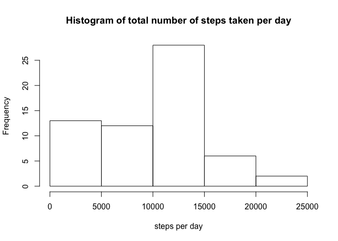
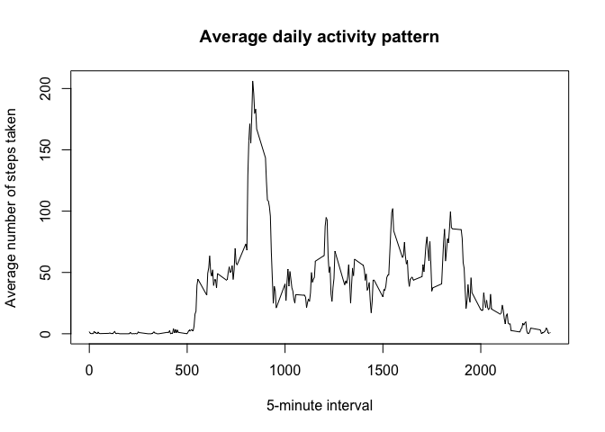
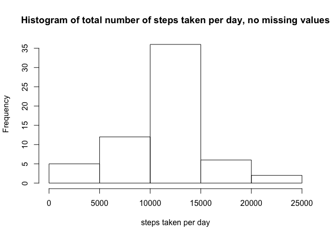
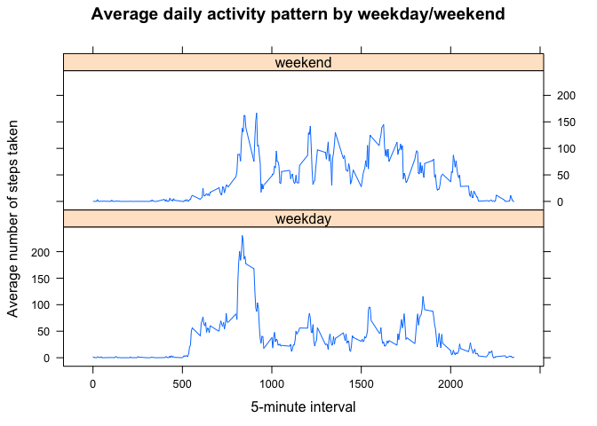

# Reproducible Research: Peer Assessment 1


## Loading and preprocessing the data

Load the data and necessary libraries:


```r
unzip("activity.zip")
data <- read.csv("activity.csv")
library(dplyr)
```

```
## 
## Attaching package: 'dplyr'
## 
## The following object is masked from 'package:stats':
## 
##     filter
## 
## The following objects are masked from 'package:base':
## 
##     intersect, setdiff, setequal, union
```

```r
library(lattice)
```

Transform date column into dates:


```r
data$date <- as.Date(data$date , "%Y-%m-%d")
summary(data)
```

```
##      steps             date               interval     
##  Min.   :  0.00   Min.   :2012-10-01   Min.   :   0.0  
##  1st Qu.:  0.00   1st Qu.:2012-10-16   1st Qu.: 588.8  
##  Median :  0.00   Median :2012-10-31   Median :1177.5  
##  Mean   : 37.38   Mean   :2012-10-31   Mean   :1177.5  
##  3rd Qu.: 12.00   3rd Qu.:2012-11-15   3rd Qu.:1766.2  
##  Max.   :806.00   Max.   :2012-11-30   Max.   :2355.0  
##  NA's   :2304
```

```r
str(data)
```

```
## 'data.frame':	17568 obs. of  3 variables:
##  $ steps   : int  NA NA NA NA NA NA NA NA NA NA ...
##  $ date    : Date, format: "2012-10-01" "2012-10-01" ...
##  $ interval: int  0 5 10 15 20 25 30 35 40 45 ...
```

## What is mean total number of steps taken per day?

Aggregate sum of steps per day:


```r
aggDataByDate <- aggregate(data[,1],by=list(data$date),sum, na.rm=TRUE)
colnames(aggDataByDate) <- c("date","steps")
```

Plot this in a histogram:


```r
hist(aggDataByDate$steps,main="Histogram of total number of steps taken per day",xlab="steps per day")
```

 

This is the mean of the total number of steps taken per day:


```r
mean(aggDataByDate$steps)
```

```
## [1] 9354.23
```

This is the median of the total number of steps taken per day:


```r
median(aggDataByDate$steps)
```

```
## [1] 10395
```

## What is the average daily activity pattern?

Aggregate steps by 5-minute interval:


```r
subsetOfData <- subset(data, select = c("steps","interval"))
aggDataByInterval <- aggregate(subsetOfData,by=list(subsetOfData$interval),mean, na.rm=TRUE)
```

Plot the data:


```r
plot(aggDataByInterval$interval,aggDataByInterval$steps,type="l",xlab="5-minute interval",ylab="Average number of steps taken",main="Average daily activity pattern")
```

 

5-minute interval which contains the maximum number of steps, when taking average across all days in the dataset is 


```r
aggDataByInterval <- tbl_df(aggDataByInterval)
max <- select(filter(aggDataByInterval,steps == max(aggDataByInterval$steps)),interval)
```

## Imputing missing values

Below we see how many NA's are in the steps column: 2,304


```r
summary(data)
```

```
##      steps             date               interval     
##  Min.   :  0.00   Min.   :2012-10-01   Min.   :   0.0  
##  1st Qu.:  0.00   1st Qu.:2012-10-16   1st Qu.: 588.8  
##  Median :  0.00   Median :2012-10-31   Median :1177.5  
##  Mean   : 37.38   Mean   :2012-10-31   Mean   :1177.5  
##  3rd Qu.: 12.00   3rd Qu.:2012-11-15   3rd Qu.:1766.2  
##  Max.   :806.00   Max.   :2012-11-30   Max.   :2355.0  
##  NA's   :2304
```

To impute the missing values, we use the mean of that row's 5-minute interval. To do this, we merge the original data with the data frame of average aggregated steps by 5-minute interval. Then we replace the missing values in the steps column of the original data frame with the mean of the aggregated steps of the associated 5-minute interval.


```r
merged <- merge(data,aggDataByInterval, by=c("interval"))
dataReplaced <- select(merged,interval,date,steps=steps.x,stepsMean=steps.y)
dataReplaced$steps[is.na(dataReplaced$steps)] <- dataReplaced$stepsMean[is.na(dataReplaced$steps)]
dataReplaced <- select(dataReplaced,interval,date,steps)
```
Here is a summary of the new dataset:


```r
summary(dataReplaced)
```

```
##     interval           date                steps       
##  Min.   :   0.0   Min.   :2012-10-01   Min.   :  0.00  
##  1st Qu.: 588.8   1st Qu.:2012-10-16   1st Qu.:  0.00  
##  Median :1177.5   Median :2012-10-31   Median :  0.00  
##  Mean   :1177.5   Mean   :2012-10-31   Mean   : 37.38  
##  3rd Qu.:1766.2   3rd Qu.:2012-11-15   3rd Qu.: 27.00  
##  Max.   :2355.0   Max.   :2012-11-30   Max.   :806.00
```

Generate new histogram of total number of steps taken each day:


```r
subsetOfData <- subset(dataReplaced, select = c("date","steps"))
aggDataByDateReplaced <- aggregate(subsetOfData$steps,by=list(subsetOfData$date),sum)
colnames(aggDataByDateReplaced) <- c("date","steps")
hist(aggDataByDateReplaced$steps,main="Histogram of total number of steps taken per day, no missing values",xlab="steps taken per day")
```

 

This is the mean of the total number of steps taken per day:


```r
mean(aggDataByDateReplaced$steps)
```

```
## [1] 10766.19
```

This is the median of the total number of steps taken per day:


```r
median(aggDataByDateReplaced$steps)
```

```
## [1] 10766.19
```

After imputing missing data, the mean and median are the same in the new dataset, while they differed by a little over 1000 steps in the original dataset. They are also both slightly higher than in the original dataset with the missing values. Therefore, imputing missing values led the mean and median to converge, and increased the average values.

## Are there differences in activity patterns between weekdays and weekends?

Add a new factor variable to specify if this is a weekday or a weekend:


```r
dataReplaced$date <- as.Date(dataReplaced$date , "%Y-%m-%d")
dataReplacedDayType <- mutate(dataReplaced, weekday = weekdays(date),dayType='weekday')
dataReplacedDayType <- mutate(dataReplacedDayType, dayType = ifelse(weekday == 'Saturday' | weekday == 'Sunday', 'weekend','weekday'))
dataReplacedDayType <- select(dataReplacedDayType, interval,date,steps,dayType)
dataReplacedDayType$dayType <- as.factor(dataReplacedDayType$dayType)
str(dataReplacedDayType)
```

```
## 'data.frame':	17568 obs. of  4 variables:
##  $ interval: int  0 0 0 0 0 0 0 0 0 0 ...
##  $ date    : Date, format: "2012-10-01" "2012-11-23" ...
##  $ steps   : num  1.72 0 0 0 0 ...
##  $ dayType : Factor w/ 2 levels "weekday","weekend": 1 1 2 1 2 1 2 1 1 2 ...
```

Aggregate steps by 5-minute interval:


```r
subsetOfDataByType <- subset(dataReplacedDayType, select = c("steps","interval","dayType"))
aggDataByIntervalByType <- aggregate(subsetOfDataByType$steps,by=list(subsetOfDataByType$interval,subsetOfDataByType$dayType),mean)
colnames(aggDataByIntervalByType) <- c("interval","dayType","stepsMean")
```

Here is a panel plot containing a time series plot of the 5-minute intervals and the average number of steps taken, averaged across all weekdays or weekend days.


```r
xyplot(stepsMean ~ interval |dayType,data=aggDataByIntervalByType,type="l",xlab="5-minute interval",ylab="Average number of steps taken",main="Average daily activity pattern by weekday/weekend",layout=c(1,2))
```

 
